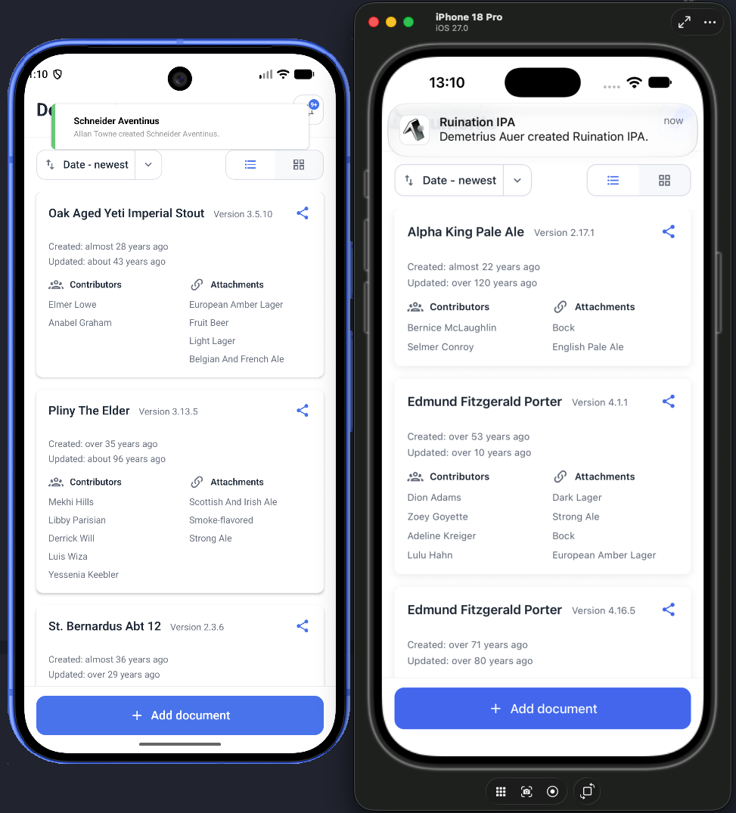
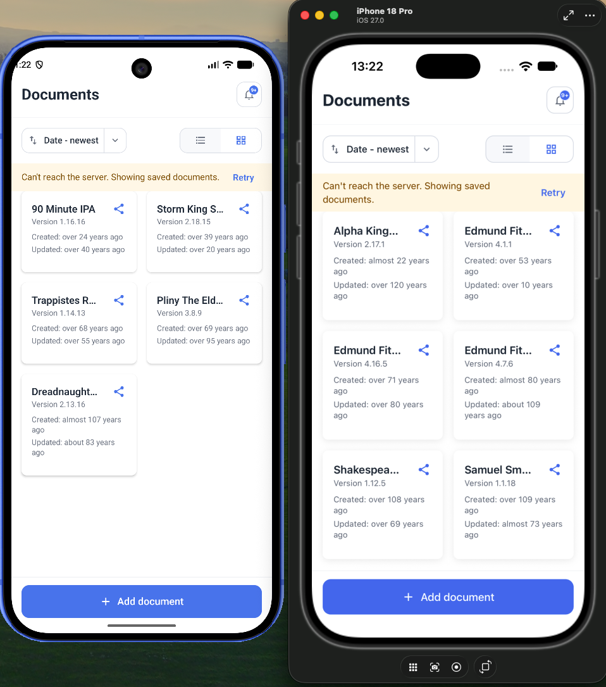
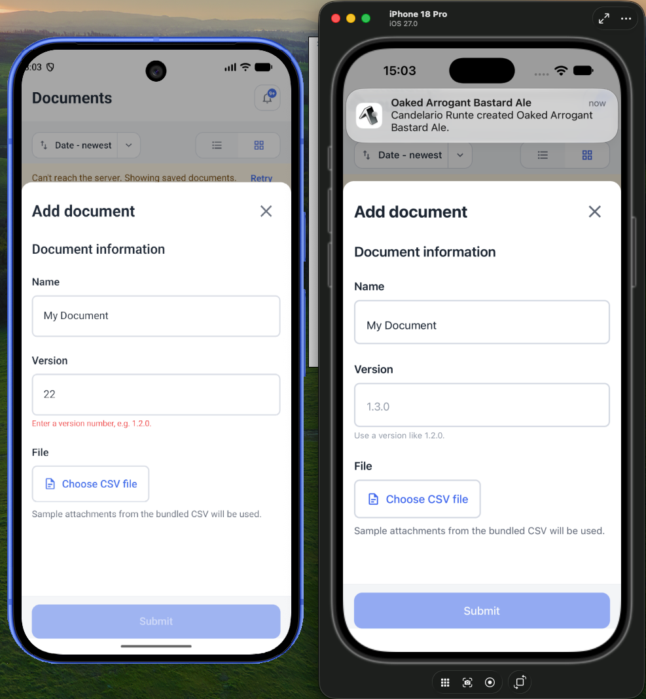
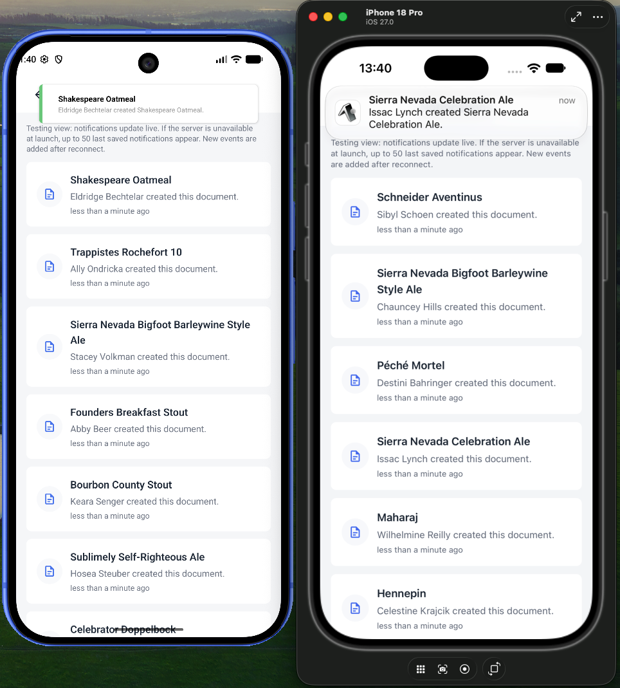

# Documents App

A small Expo and React Native application built for a **Senior React Native Developer** position recruitment task. It displays documents from the supplied mock server, receives live document notifications via WebSocket, and supports creating a document locally. There is no database, ORM or custom backend client framework as specified in the task description.

The supplied server is a mock: it generates new random documents on every request and has no document-creation endpoint. A document created in the app is therefore local-only and may be replaced by the next successful fetch. Notifications are random events generated by the server.

## Requirements

- Node.js **22.13 or newer** for the Expo SDK used by this project.
- npm.
- Go, to run the supplied mock server.
- Xcode and an iOS Simulator for iOS, or Android Studio and an Android Emulator for Android.

## Run the app

### 1. Get the mock server

Place the companion server repository beside this one and name its directory `documents-server`:

```text
parent-directory/
├── documents-app/
└── documents-server/
```

The `server` npm script runs the server from that sibling directory.

### 2. Install dependencies and configure the server URL

From `documents-app`:

```bash
npm install
```

Create a `.env` file in the project root:

```env
EXPO_PUBLIC_API_URL_IOS=http://localhost:8080
EXPO_PUBLIC_API_URL_ANDROID=http://10.0.2.2:8080
```

The Android Emulator uses `10.0.2.2` to reach the host machine.

### 3. Start the server

```bash
npm run server
```

### 4. Start the app

In a second terminal, start the target platform:

```bash
npm run ios
```

or:

```bash
npm run android
```

To run both platforms at once, start a separate Expo process for each platform and choose a different Metro port for the second process when prompted. Both app instances can share the Go server. The project is designed to run on simulators while connecting to the server via localhost.

## Features

### Required features

- **Most recent documents in list or grid view — ✅** Documents are displayed using a single `FlatList`, with the view toggle switching between a single-column list and a two-column grid. Since both views use the same underlying data and only differ in their layout and level of detail, I chose to re-render the list when the view mode changes rather than maintaining two separate `FlatList` instances. This keeps the implementation simpler and avoids duplicating list configuration and behavior. When using grid view, the number of columns can be easily modified be updating the `GRID_MODE_COLUMNS_COUNT` variable. The sort selector is also fully functional and supports sorting by date and title.
- **Real-time notifications for documents created by other users — ✅** A WebSocket connection receives notification events and presents each event immediately. Android uses in-app toast messages, whereas iOS schedules native local notifications. The newest-first in-app list is updated in a short batch to reduce state updates during bursts. The connection automatically retries with backoff after a disconnect, and the home screen displays connecting/reconnecting status.
- **Create a document — ✅** The add-document sheet collects a name, version, and attachment CSV, parses attachment names, then adds the new document to local state. In development, a bundled CSV supplies sample attachments when no file is selected. The mock server has no create endpoint, so the next successful fetch replaces locally created documents with its newly generated list.

### Optional features

- **Offline support — ✅** Documents load from the server first and use saved data only if the initial fetch fails, later retry failures keep the current list. Notifications use saved data only if the initial WebSocket connection fails, then add new events after reconnecting. The notification list is newest-first and capped. A much better solution in production would be to use an offline-first database with synchronization.
- **Local notifications — ✅ on iOS.** Received WebSocket events are scheduled as native local notifications on iOS. Android presents notifications as in-app toast messages. I chose this platform split to demonstrate two ways of solving the notification task. Neither adds remote push delivery while the app is closed.
- **Pull to refresh — ✅** Fetches a new array of mock documents. There is also an error banner which provides a retry button when a fetch fails.
- **Native share button — ✅** Each document card can be shared as a JSON file through the platform share sheet.
- **Relative dates — ✅** Document cards show created and updated timestamps as relative labels, formatted with `date-fns`.

### Additional features

- **Notifications screen.** The bell button opens a screen with a list of the latest notifications, newest first. It updates from the WebSocket stream and if the server is unavailable at launch, the saved list is shown and new events are added after reconnecting.
- **Animated list/grid transition.** Switching document views remounts the `FlatList` with the new column count. Cards fade and move into the new layout with a short stagger.
- **Document creation celebration.** After a document is added successfully, a brief burst of emoji confetti flies outward above the Add button and fades away. The reusable `CelebrationAnimation` component lives in `src/components/animations/` and uses Reanimated for UI-thread animations.
- **Validated server boundary and normalized data.** HTTP and WebSocket payloads are normalized from the server's field naming and parsed with Zod before entering app state. Malformed WebSocket messages are logged and skipped so one bad event does not break the stream.
- **Stable-connection retry reset.** Notification reconnection uses capped exponential backoff and resets its retry delay after the socket has stayed connected, avoiding a long delay after a brief later disconnect.

## Project Structure

```text
src/
├── app/           Expo Router entry points and app-level providers
├── features/      Document screen and feature-specific components
├── components/    Reusable UI components and animations
├── schemas/       Zod runtime schemas and inferred API types
├── services/      HTTP, WebSocket, URL configuration, and local storage
├── stores/        React context providers for documents and notifications
├── types/         Shared non-schema type declarations
└── utils/         Pure helpers, including key normalization and CSV parsing
```

## Server integration

- `GET /documents` returns an array of documents. The app normalizes field names, validates the array with `DocumentsSchema`, and replaces the current server-backed list on success.
- `GET /notifications` is a WebSocket stream. Each message is parsed as JSON, normalized, and validated with `NotificationSchema`. Presentation happens immediately, while list and storage updates are batched. Invalid messages are logged and skipped. A closed connection is retried with backoff.

The app uses the configured platform URL for both endpoints. The mock server generates random data and does not persist changes made by clients.

## Tests and quality checks

Run the automated unit tests:

```bash
npm test
```

The suite includes sample tests at several layers:

- **Unit tests** for CSV parsing and recursive key normalization. These helpers have deterministic input and output, and parsing edge cases such as blank cells or line endings are easy to cover directly.
- **Service tests** for `fetchDocuments`. They verify the endpoint URL, conversion of the server's field names, and that request or schema-validation failures are returned as errors.
- **Provider tests** for document loading. They cover a successful initial fetch and the failure-then-retry path, where the provider exposes the error and then recovers with server data.
- **Component flow test** for `AddDocumentSheet`. It enters document details, selects a CSV source, and checks that the resulting document is added to provider state. Native bottom-sheet and file-picker behavior is mocked so the test stays deterministic and does not require a simulator.

Run lint and TypeScript checks separately:

```bash
npm run lint
npm run typecheck
```

The pre-commit hook runs both checks. These tests provide focused coverage of pure logic, they do not replace device-level or end-to-end testing against a running server.

## Dependencies

- **`axios`** — HTTP request handling.
- **`zod`** — Runtime validation for HTTP and WebSocket payloads, with TypeScript types inferred from the schemas.
- **`expo-sqlite`** — SQLite-backed key-value store for the local document and notification cache.
- **`expo-document-picker`** and **`expo-file-system`** — Select and read attachment CSV files, and create the JSON share file.
- **`expo-sharing`** — Open the native share sheet for document exports.
- **`expo-notifications`** — Present notification events as in-app notifications on iOS.
- **`react-native-toast-message`** — Present notification events as in-app toasts on Android.
- **`@gorhom/bottom-sheet`** — Add-document sheet presentation and interactions; [recommended by the Reanimated team](https://docs.swmansion.com/react-native-reanimated/examples/bottomsheet/).
- **`date-fns`** — Relative date formatting.
- **`expo-asset`** — Resolve the bundled development CSV asset across platforms.
- **`expo-crypto`** — Generate document IDs for locally created documents.
- **`@expo/vector-icons`** — Native-friendly interface icons.
- **`react-native-safe-area-context`** — Respect device safe areas around screen controls.

Test and development dependencies are listed under `devDependencies` in `package.json`. The test suite uses **`@testing-library/react-native`** for component and provider tests.

## Screenshots

Each screenshot shows the app running in the iOS Simulator and Android Emulator side by side.

### List view



### Grid view



### Add document sheet



### Notifications screen



## AI assistance

AI tools were used to draft parts of the design system, UI components, implementation ideas, and this README. The code and documentation were reviewed and edited during development.
